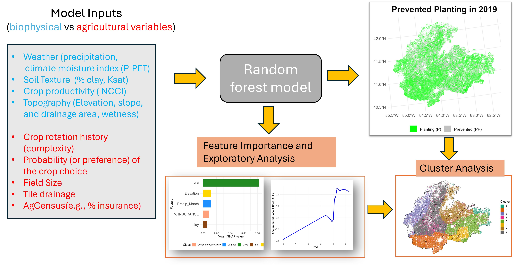

# ML-based Crop prevented planting 
Develop ML model to predict the prevented planting 

This project develops a machine learning model (ML) to predicted spatial crop prevented planting dynamics.

*ML for crop prevented planting simulation.*

